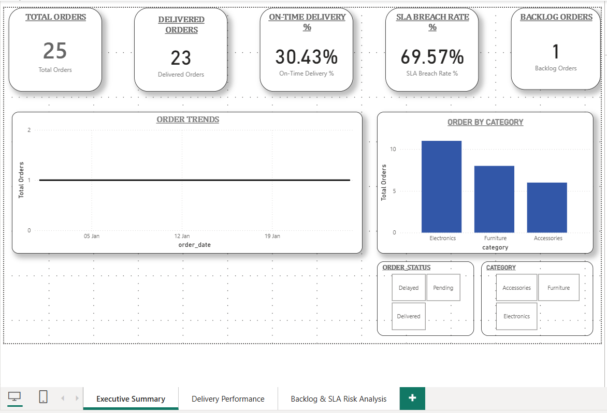
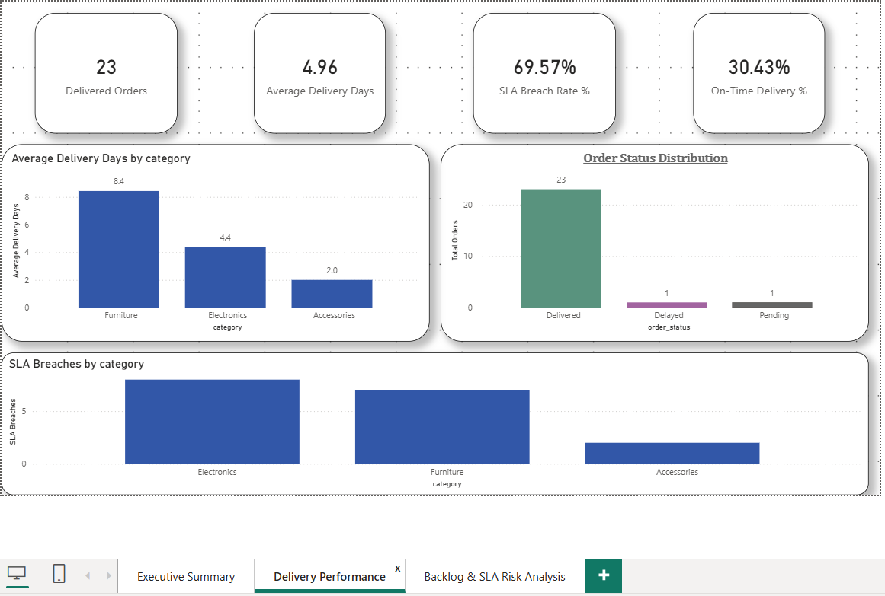
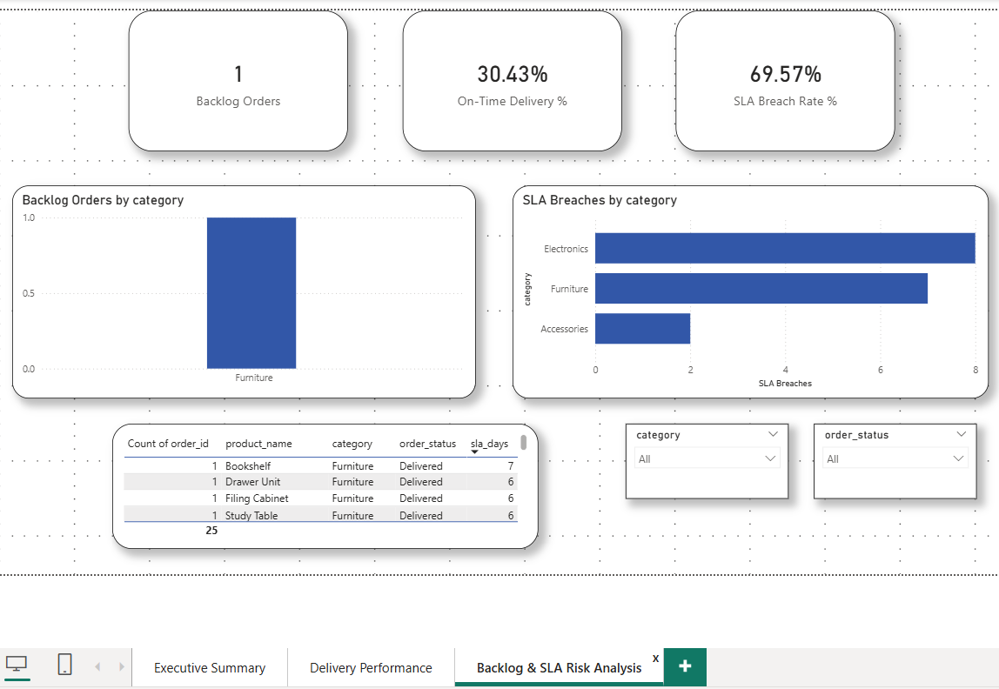

# Amazon Operations Analytics Dashboard 📦📊

A Power BI dashboard project simulating Amazon-style operations analytics, focused on **order tracking, SLA compliance, delivery performance, and backlog monitoring**.

This project demonstrates end-to-end analytics skills including **data modeling, SQL-based KPI logic, Power BI visualization design, and executive-level reporting**.

---

## 🔍 Project Objective

To analyze e-commerce operational data and answer key business questions such as:
- How many orders are delivered vs delayed?
- Are orders meeting SLA timelines?
- Which categories contribute most to SLA breaches?
- Where are operational bottlenecks forming?

---

## 🧱 Dataset Overview

The project uses **synthetic Amazon-style data** consisting of:

### Products Table
- `product_id`
- `product_name`
- `category`
- `sla_days`

### Orders Table
- `order_id`
- `order_date`
- `dispatch_date`
- `delivery_date`
- `order_status`
- `product_id`
- `customer_id`

Data is stored in the `/data` folder as CSV files.

---

## 📐 Data Modeling

- One-to-many relationship between **Products → Orders**
- SLA performance calculated using:
  - Delivery duration
  - Product-level SLA days
- Derived KPIs implemented using **DAX measures**

---

## 📊 Dashboard Pages

### 1️⃣ Executive Summary
High-level operational KPIs for leadership overview:
- Total Orders
- Delivered Orders
- On-Time Delivery %
- SLA Breach Rate %
- Backlog Orders
- Order Trends over time
- Orders by Category

📷 Screenshot:  


---

### 2️⃣ Delivery Performance
Detailed delivery efficiency analysis:
- Average Delivery Days by Category
- Order Status Distribution
- SLA Breaches by Category
- Key delivery KPIs for quick assessment

📷 Screenshot:  


---

### 3️⃣ Backlog & SLA Analysis
Focused view on operational risks:
- Backlog Orders by Category
- SLA Breach concentration by category
- Drill-down table for impacted products
- Category and Order Status filters

📷 Screenshot:  


---

## 🧮 Key Metrics Calculated

- **On-Time Delivery %**
- **SLA Breach Rate %**
- **Average Delivery Days**
- **Backlog Orders Count**
- **Orders by Status and Category**

All SQL logic used for KPI validation is available in `/sql/kpi_queries.sql`.

---

## 🛠 Tools & Technologies

- **Power BI Desktop**
- **SQL**
- **DAX**
- **Excel / CSV**
- **GitHub for version control**

---

## 📁 Repository Structure
```text
Amazon-Ops_Dashboard/
│
├── data/
│ ├── products.csv
│ └── sample_orders.csv
│
├── sql/
│ ├── customers_table.sql
│ ├── products_table.sql
│ ├── orders_table.sql
│ ├── kpi_queries.sql
│ └── vw_order_kpis.sql
│
├── powerbi/
│ └── Amazon_Ops_Dashboard.pbix
│
├── screenshots/
│ ├── Executive_Summary.png
│ ├── Delivery_Performance.png
│ └── Backlog_SLA.png
│
├── docs/
│ └── dashboard_planning.md
│
├── LICENSE
└── README.md
```
---

## 🚀 Key Takeaways

- Built a **production-style operations dashboard**
- Designed visuals with **executive readability in mind**
- Applied **real-world SLA and delivery logic**
- Practiced end-to-end analytics workflow from raw data to insights

---

## 👤 Author

**Aparna Bhardwaj**  
Aspiring Data Analyst | Operations Analytics | Power BI & SQL  

---

> ⚠️ This project uses simulated data for learning and demonstration purposes.


